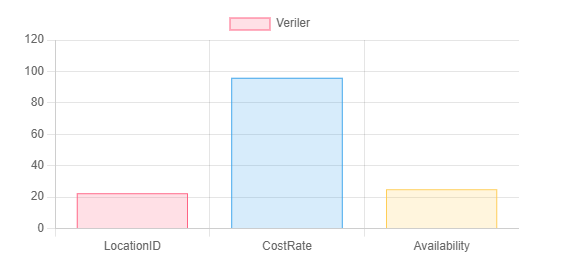
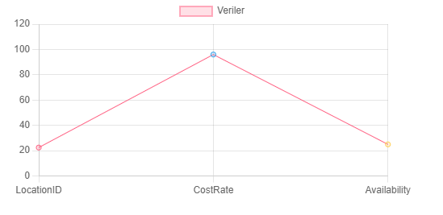
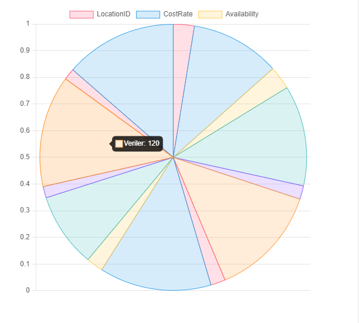

# Dinamik Grafik Uygulaması

**Dinamik Grafik Uygulaması**'na hoş geldiniz! Bu uygulama, kullanıcıların SQL sorgularından elde edilen verileri dinamik olarak grafiklere dönüştürmesine olanak tanır. Veri analistleri, geliştiriciler veya verilerini hızlıca görselleştirmek isteyen herkes için ideal bir araçtır.

## İçindekiler

- [Genel Bakış](#genel-bakış)
- [Özellikler](#özellikler)
- [Başlarken](#başlarken)
  - [Gereksinimler](#gereksinimler)
  - [Kurulum](#kurulum)
  - [Uygulamayı Çalıştırma](#uygulamayı-çalıştırma)
- [Mimari](#mimari)
  - [Backend (Sunucu Tarafı)](#backend-sunucu-tarafı)
  - [Frontend (Ön Yüz)](#frontend-ön-yüz)
- [Kullanım](#kullanım)
  - [Girdi Alanları](#girdi-alanları)
  - [Desteklenen Grafik Türleri](#desteklenen-grafik-türleri)
  - [Örnek SQL Sorguları](#örnek-sql-sorguları)


## Genel Bakış

Dinamik Grafik Uygulaması, bir SQL veritabanına bağlanarak kullanıcı tarafından sağlanan sorguları çalıştırır ve ardından elde edilen verileri çeşitli grafik türlerinde görselleştirir. Bu araç, verilerinden hızlıca eğilimler, desenler ve içgörüler elde etmek isteyen herkes için son derece kullanışlıdır.

## Özellikler

- **Dinamik Veri Görselleştirme:** Gerçek zamanlı SQL sorgularına dayalı grafikler oluşturma.
- **Çoklu Grafik Türleri:** Çubuk grafik, çizgi grafik ve pasta grafik desteği.
- **Kullanıcı Dostu Arayüz:** Hem kullanımı kolay hem de görsel olarak çekici, temiz ve şık bir tasarım.
- **Duyarlı Tasarım:** Masaüstü, tablet ve mobil cihazlarda sorunsuz çalışır.

## Başlarken

### Gereksinimler

Başlamadan önce aşağıdaki gereksinimlerin karşılandığından emin olun:

- **.NET 6.0 SDK:** Resmi [.NET web sitesinden](https://dotnet.microsoft.com/download/dotnet/6.0) indirebilirsiniz.
- **SQL Server:** SQL Server kurulumu ve gerekli sorguları çalıştırma izinlerine sahip olmalısınız.

  
### Kurulum

1. **Depoyu klonlayın:**

   ```bash
   git clone https://github.com/gizemclskn/DynamicChartApp.git
   cd DynamicChartApp

 2. **Bağımlılıkları yükleyin:**

   Visual Studio veya tercih ettiğiniz IDE'de çözümü açın ve NuGet paketlerini geri yükleyin.
  ## Uygulamayı Çalıştırma

1. **Uygulamayı Başlatın**:

   IDE'nizde `DynamicChartApp` projesini başlangıç projesi olarak ayarlayın ve uygulamayı çalıştırın.

2. **Uygulamaya Erişin**:

   Uygulama çalıştıktan sonra tarayıcınızı açın ve `https://localhost:7172` adresine gidin.
## Mimari

### Backend (Sunucu Tarafı)

- **ASP.NET Core 6.0:** Sunucu tarafı ASP.NET Core kullanılarak inşa edilmiştir ve RESTful API uç noktaları sağlar.
- **DatabaseService:** SQL sorgularını çalıştırma ve veri alma işlemlerini gerçekleştiren servis katmanı.

### Frontend (Ön Yüz)

- **HTML5/CSS3/Bootstrap:** Modern web standartları ve Bootstrap kullanılarak tasarlanmıştır.
- **Chart.js:** Dinamik grafiklerin oluşturulmasında kullanılan güçlü bir görselleştirme kütüphanesi.
## Kullanım

### Girdi Alanları

- **Bağlantı Dizesi**: SQL Server bağlantı dizesini girin.
- **SQL Sorgusu**: Geçerli bir SQL sorgusu girin. Sorgu, görselleştirilebilecek veriler döndürmelidir (örneğin, `SELECT` ifadeleri).
- **Grafik Türü**: Oluşturmak istediğiniz grafik türünü seçin (Çubuk, Çizgi, Pasta).

### Desteklenen Grafik Türleri

- **Çubuk Grafik**: Farklı kategorileri karşılaştırmak için idealdir.
- **Çizgi Grafik**: Zaman içindeki eğilimleri göstermek için uygundur.
- **Pasta Grafik**: Bir bütüne ait oranları göstermek için kullanılır.





### Örnek SQL Sorguları
- **SQL Queryr**:
Aşağıdaki sorgu, `Production.Location` tablosunda `CostRate` veya `Availability` sütunlarında sıfırdan büyük değerleri olan kayıtları seçer:

```sql
SELECT 
    LocationID,
    CostRate,
    Availability
FROM 
    [Production].[Location]
WHERE 
    CostRate > 0 OR Availability > 0;


